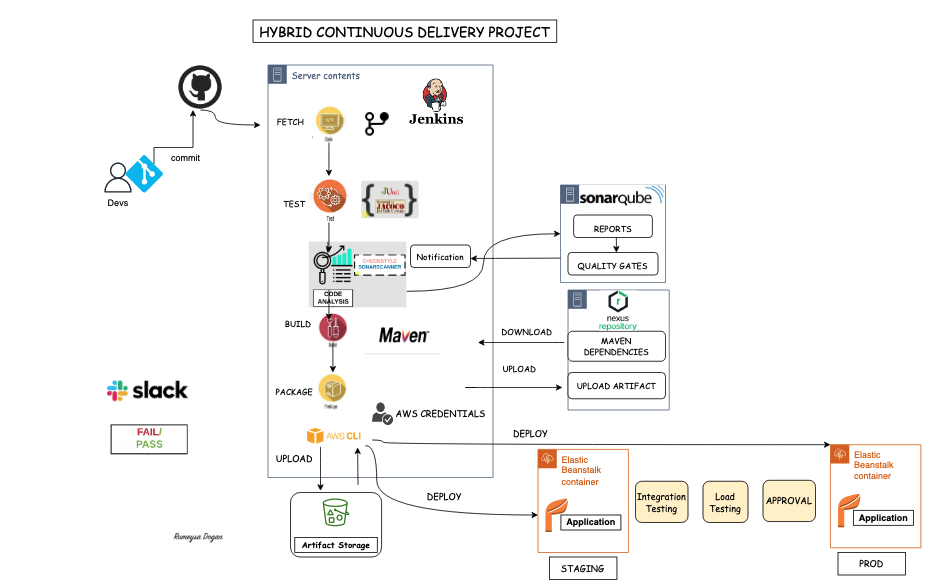
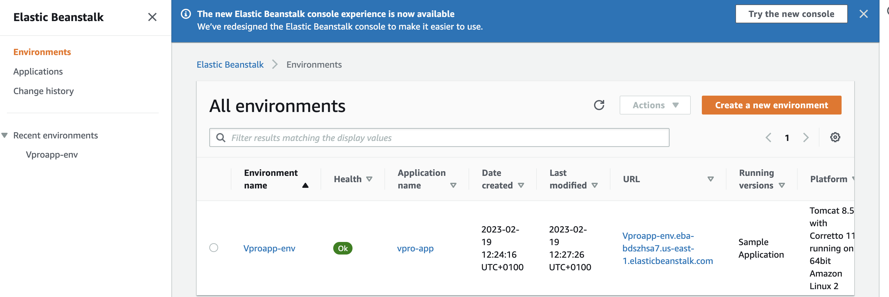
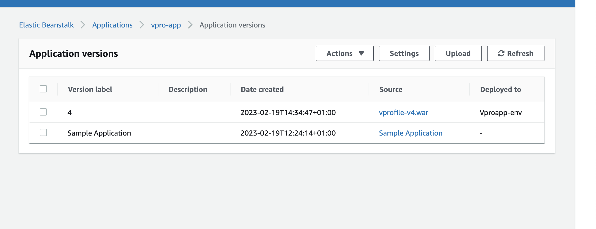
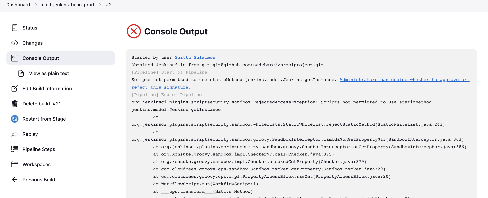
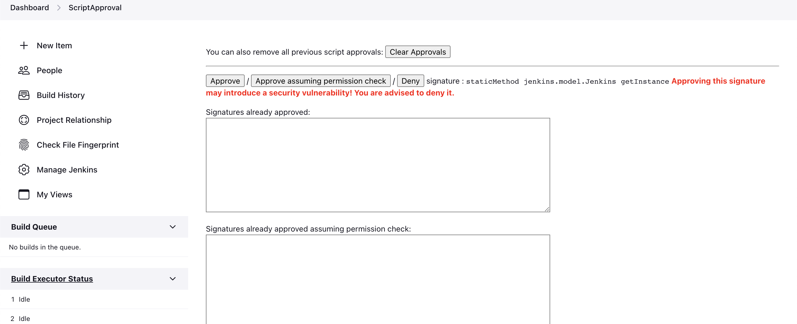

# HYBRID CONTINUOUS DELIVERY USING JENKINS AND AMAZON WEB SERVICE (AWS)

##  System Design

##  Prerequisite
  + [Project-7](https://github.com/sadebare/DevOps_101_Projects/tree/main/PROJECT_7)

  + [Project-8](https://github.com/sadebare/DevOps_101_Projects/tree/main/PROJECT_8)

##  Step 1: Validate continuous integration from jenkins
  + Update the Github webhook with the current jenkins public IP address
  + Test the contineous integration pipeline on jenkins
    
  + Get into the jenkins server via SSH and run the ffg commands

        sudo apt update
        sudo apt install awscli -y
##  Step 2: S3, IAM and Beanstalk setup
  + Create an IAM user for Beanstalk:- This user will be used with AWS CLI. It needs to access to S3 to download the artifact, it also need to access Benastalk environment to upload the latest artifact from S3 bucket. Download the csv credentials.

        Name: cicd-bean
        Permissions options: Attach policies directly
        Permissions policies: 
        + AmazonS3FullAccess
        + AdministratorAccess-AWSElasticBeanstalk
  + Create Credentials in Jenkins for Beanstalk IAM user:- Create a global credentials with below properties.

        Kind: AWS Credentials
        ID: awsbeancreds
        Description: awsbeancreds
        AccessKeyID
        Secret Access Key
  + Create an S3 bucket for Beanstalk named vprofcicdbeans-55
  + Create an application in Bealstalk with below properties.

        Name: vpro-app
        Platform: Tomcat
        Custom configuration
        ##Capacity:
        + Load Balanced
        + Min: 2
        + Max: 4
        InstanceType: t2.micro
        ##  Rolling updates and deployments
        + Policy: Rolling
        + 50 %
    
##  Step 3: Pipeline Setup For Staging
  + We will be creating a Jenkinsfile in our repository `vprociproject`and create a new branch and make updates in Jenkinsfile from ci-jenkins.

        git checkout ci-jenkins
        git checkout -b cicd-jenbean-stage
  + Add the few variables and stage to the jenkins pipeline to deploy the artifact to elastic beanstalk

        ## Variables to add ###
        ARTIFACT_NAME = "vprofile-v${BUILD_ID}.war"
        AWS_S3_BUCKET = 'vprocicdbean'
        AWS_EB_APP_NAME = 'vproapp'
        AWS_EB_ENVIRONMENT = 'Vproapp-env'
        AWS_EB_APP_VERSION = "${BUILD_ID}"
        ### New stage to deploy beanstalk##
        stage('Deploy to Stage Bean'){
                  steps {
                    withAWS(credentials: 'awsbeancreds', region: 'us-west-1') {
                      sh 'aws s3 cp ./target/vprofile-v2.war s3://$AWS_S3_BUCKET/$ARTIFACT_NAME'
                      sh 'aws elasticbeanstalk create-application-version --application-name $AWS_EB_APP_NAME --version-label $AWS_EB_APP_VERSION --source-bundle S3Bucket=$AWS_S3_BUCKET,S3Key=$ARTIFACT_NAME'
                      sh 'aws elasticbeanstalk update-environment --application-name $AWS_EB_APP_NAME --environment-name $AWS_EB_ENVIRONMENT --version-label $AWS_EB_APP_VERSION'
                    }
                  }
                }
  + Upon the modification, we can then push the changes to the Github remote repository
  + Before deployment, we need to change Health check path in Beanstalk application config settings. Our application is being stable at /login path.
  
  + We can then create a pipeline with below properties.

        Name: cicd-jenkins-bean-stage
        Kind: pipeline
        Pipeline from SCM
        SSH GitHub URL
        githublogin credentials
        Branch: */cicd-jenbean-stage
    
    
    

  ##  Step-4: Pipeline Setup for Production
  + We will create a new environment for production in Beanstalk. (Elastic beanstalk -> Applications -> vpro-app ->  Create a new environment)

          Webserver environment
          Name: Vproapp-prod-env
          Domain: Vproapp-prod-env
          Platform: Tomcat 
          Sample Application
          Custom configuration
          ##Capacity:
          - Load Balanced
          - Min: 2
          - Max: 4
          InstanceType: t2.micro
          ##  Rolling updates and deployments
          - Policy: Rolling
          - 50 %
  
  +  we will update Health check path to /login as we did in previous steps. Then apply our changes, once environment is stable.
  + Go to vprofileciproject repository in local. We will create a new branch and make updates in Jenkinsfile from ci-jenkins.

        git checkout -b cicd-jenbean-prod
  + We would like to get the artifact that is uploaded to beanstalk stage environment and deploy the same artifact to prod. We will add a login in Jenkinsfile to achieve the same.Below is the Jenkinsfile we will be using for Production deployment.

        def buildNumber = Jenkins.instance.getItem('cicd-jenkins-bean-stage').lastSuccessfulBuild.number

        def COLOR_MAP = [
            'SUCCESS' : 'good',
            'FAILURE' : 'danger'
        ]

        pipeline {
            agent any
            tools {
                maven "MAVEN3"
                jdk "OracleJDK8"
            }

            environment {
                SNAP_REPO = 'vprofile-snapshot'
                NEXUS_USER = 'admin'
                NEXUS_PASS = 'admin'
                RELEASE_REPO = 'vprofile-release'
                CENTRAL_REPO = 'vpro-maven-central'
                NEXUSIP = '172.31.24.38'
                NEXUSPORT = '8081'
                NEXUS_GRP_REPO = 'vpro-maven-group'
                NEXUS_LOGIN = 'nexuslogin'
                SONARSERVER = 'sonarserver'
                SONARSCANNER = 'sonarscanner'
                ARTIFACT_NAME = "vprofile-v${buildNumber}.war"
                AWS_S3_BUCKET = 'vprofcicdbeans-55'
                AWS_EB_APP_NAME = 'vpro-app'
                AWS_EB_ENVIRONMENT = 'Vprofapp-prod-env'
                AWS_EB_APP_VERSION = "${buildNumber}"
            }
            
            stages{
                stage('DEPLOY to Prod BEAN'){
                        steps {
                        withAWS(credentials: 'awsbeancreds', region: 'us-east-1') {
                            sh 'aws elasticbeanstalk update-environment --application-name $AWS_EB_APP_NAME --environment-name $AWS_EB_ENVIRONMENT --version-label $AWS_EB_APP_VERSION'
                            }
                        }
                    }
          }
          
          post{
          always {
              echo 'Slack Notifications'
              slackSend channel: '#jenkinscicd',
                  color: COLOR_MAP[currentBuild.currentResult],
                  message: "*${currentBuild.currentResult}:* Job ${env.JOB_NAME} build ${env.BUILD_NUMBER} \n More info at: ${env.BUILD_URL}"
          }
        }
        }
  + Commit/push the changes in GitHub.
  + Now, create a pipeline with below properties.

        Name: cicd-jenkins-bean-prod
        Kind: pipeline
        Copy from: cicd-jenkins-bean-stage
        branch: */cicd-jenbean-prod
  + Let's run the pipeline. Ok, it failed with below error message. Right click on blue error and Open in new tab we need to approve it.
    
  + Since we are running this pipeline from another pipeline it asks this Approval.

  
  + We need to Approve these few times, after Build Failure. Each time it is asking for different approval. This is only one time activity. At 5th time, pipeline run successfully.
  
  + We can see that the same version of application from stage environment is deployed to Production environment now.
##  Step-5: CICD Flow
  + Developers make code changes to staging environment. Once it is pushed to GitHub CI/CD Stage pipeline will be triggered. After approvals, staging branch will be merged to production branch. This will trigger CI/CD Prod pipeline. We will get notifications from Slack.
  + Its time to delete resources we have craeted stopping jenkins, nexus and sonar servers.