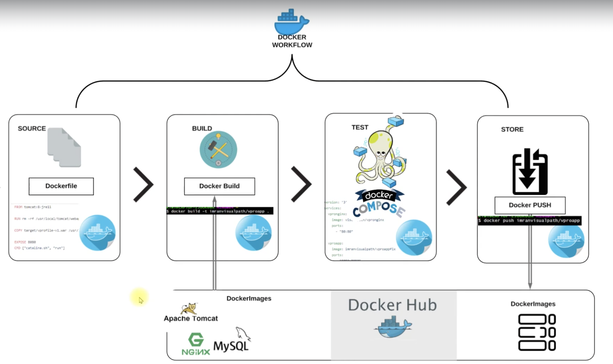
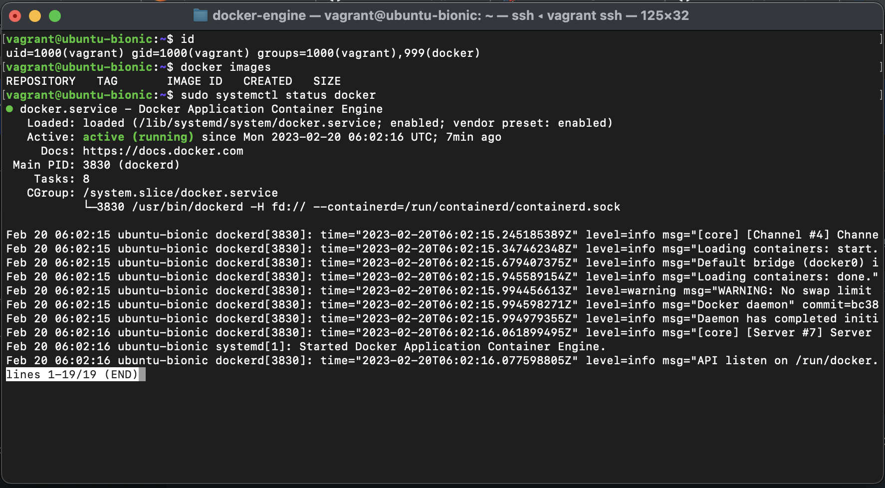
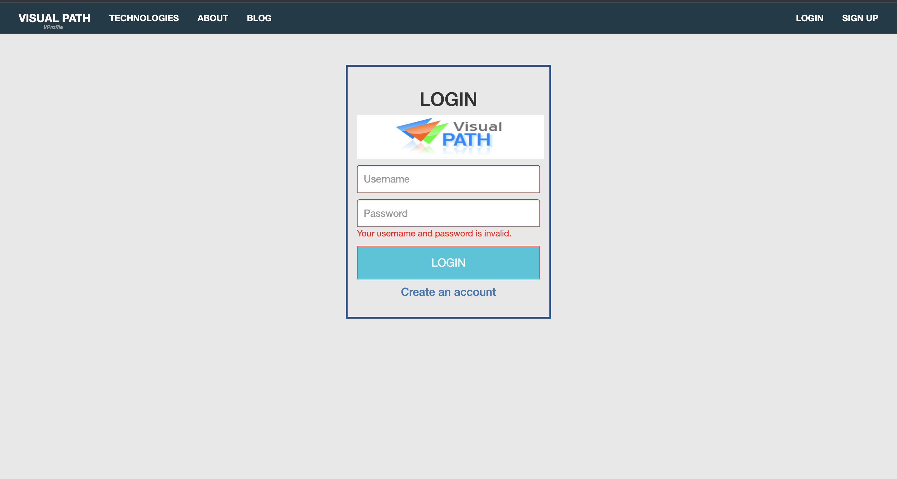

# CONTAINERIZATION OF JAVA PROJECT USING DOCKER

##  SYSTEM DESIGN

##  Pre-requisite
  + DockerHub account
  + Docker Engine
  + Virtual machine or AWS instance

### Step 1: Get Overview Of Base Images
  + For the base images, we will be relying on [Dockerhub](https://hub.docker.com/) as our container registry to use.
  + For our Vprofile project, we will be needing five images

        + Tomcat
        + MySQL
        + RabbitMQ
        + Memcached
        + Nginx
          
### Step 2: Dockerhub Setup
  + We will be creating a [dockerhub-account](https://hub.docker.com/signup) where we get to pull our base images and push our customized images on

### Step 3: Setup Docker Engine
  + We will create an Ubuntu machine with Vagrant to run our Docker commands. First, lets create a new directory docker-engine. We will run vagrant init ubuntu/bionic64 command which will create an Ubuntu 18.04 machine for us.

        mkdir docker-engine
        cd docker-engine
        vagrant init ubuntu/bionic64
  + We can give an IP address by updating Vagrantfile to access the VM. Uncomment the line given below, which will create a Private network only host can use it to test in this VM.

        vim Vagrantfile
        ### Uncomment the config.vm.network in the Vagrantfile like below ###
        # Create a private network, which allows host-only access to the machine
        # using a specific IP.
        config.vm.network "private_network", ip: "192.168.33.12"
  + Time to create the VM. And ssh into it.

        vagrant up
        vagrant ssh
  + We will go to official Docker [Documentation](https://docs.docker.com/engine/install/ubuntu/) to get Docker installation steps for Ubuntu 18.04. Follow the installation steps. Once all steps completed, run below command:

        docker --version
  + We need to add vagrant user to Docker group to be able to run docker commands. Once we add the user, we will exit and log back in. Now we are able to run docker commands successfully.

        whoami
        docker images
        sudo usermod -aG docker vagrant
        exit
        vagrant ssh
        id # verify that vagrant user is part of docker group now
        docker images 
  

### Step 4: Dockerfile References
  + I will use Vscode (any IDE is fine) while creating my images. First I will clone the [repository](https://github.com/apotitech/vprofile-project) in the same directory that I have created my Vagrantfile, this will give me capability to quickly test Docker images that I will create for my application services.
  + We will be using the branch `docker` in the repository, where we will be using a directory `Docker-files` to store our dockerfile we will be creating.
  [Docker file creation Documentation](https://docs.docker.com/engine/reference/builder/)
  + On the docker hub, we will be creating three repositories:

        vprofileapp - For the actual java application
        vprofileweb - where we host Nginx
        vprofiledb - For mysql
    

### Step 5: Dockerfile For App Image (TOMCAT)
  + Create a `app` directory in the `Docker-file` 
  + Inside the `app` directory, we then create a file `Dockerfile` with the content

        FROM tomcat:8-jre11
        LABEL "Project"="Vprofile"
        LABEL "Author"="Barry"

        RUN rm -rf /usr/local/tomcat/webapps/*
        COPY target/vprofile-v2.war /usr/local/tomcat/webapps/ROOT.war

        EXPOSE 8080
        CMD ["catalina.sh", "run"]
        WORKDIR /usr/local/tomcat/
        VOLUME /usr/local/tomcat/webapps

### Step 6: Dockerfile For DB Image (MYSQL)
  + Create a `db` directory in the `Docker-file` 
  + Inside the `db` directory, we then create a file `Dockerfile` with the content

        FROM mysql:5.7.25
        LABEL "Project"="Vprofile"
        LABEL "Author"="Barry"

        ENV MYSQL_ROOT_PASSWORD="vprodbpass"
        ENV MYSQL_DATABASE="accounts"

        ADD db_backup.sql docker-entrypoint-initdb.d/db_backup.sql
  + We need to copy db_backup.sql file from src/main/resources directory to db directory where our DB Dockerfile exists.

### Step 7: Dockerfile For Web Image (NGINX)
  + Create a `web` directory in the `Docker-file` 
  + Inside the `web` directory, we then create a file `Dockerfile` with the content

        FROM nginx
        LABEL "Project"="Vprofile"
        LABEL "Author"="Barry"

        RUN rm -rf /etc/nginx/conf.d/default.conf
        COPY nginvproapp.conf /etc/nginx/conf.d/vproapp.conf
  + We will create our own nginxvproapp.conf file under web directory with below content, and replaced in the container with default config file.

        upstream vproapp {
        server vproapp:8080;
        }
        server {
          listen 80;
        location / {
          proxy_pass http://vproapp;
        }
        }

### Step 8: Building Images
  + Before building the images, we need to have our artifact in the target directory target/vprofile-v2.war
          
          vagrant ssh
          cd /vagrant/vprofile-project/Docker-files
          ls -R
          cd ../../vprofile-project
          sudo apt install openjdk-8-jdk -y && sudo apt install maven -y
  + Upon successful installation, time to build our artifact. To be able to create our artifact Maven and JDK was installed.
  + Time to build our artifact. From project directory, run `mvn install`command.
  + Upon successful build, we will have a directory as `/target` where our artifact is been stored
  + We need to copy the artifact under `Docker-files/app` directory.
  
  + Let's build our app images now. Go to/Docker-files/app directory.Run below command:

        docker build -t <docker_hub_username>/vprofileapp:V1 .
        docker images

  + Also let's build our db images now. Go to/Docker-files/db directory.Run below command:

        docker build -t <docker_hub_username>/vprofiledb:V1 .
        docker images
  + Again, Let's build our web images now. Go to/Docker-files/web directory.Run below command:

        docker build -t <docker_hub_username>/vprofileweb:V1 .
        docker images
  + Lastly, We don't need any customization for RabbitMQ&Memcached images. We can directly pull from DockerHub.

        docker pull memcached
        docker pull rabbitmq
  + Our Docker images are ready. Next we will build our containers with Docker compose.

### Step 9: Seting up Docker-Compose
  + To run docker-compose commands, first we need to install it. We can go to [official documentation](https://docs.docker.com/compose/install/) and follow installation steps.

        sudo curl -SL https://github.com/docker/compose/releases/download/v2.14.0/docker-compose-linux-x86_64 -o /usr/local/bin/docker-compose

        sudo chmod +x /usr/local/bin/docker-compose
        docker-compose --version

  + Docker-compose is installed, next we will create docker-compose.yml file in the root directory of project which will create our containers.

  + We have to give container names same as given in `application.properties` and `nginxvproapp.conf` files.
  + If we are not sure which port to map or where to map to volume, we can use below command to get info:

        docker inspect <image_name>:<version_tag>
  + Create docker-compose.yml with below content.

        version: '3'
        services:
          vprodb:
            image: <your_dockerhub_username>/vprofiledb:V1
            container_name: vprodb 
            ports:
              - "3306:3306"
            volumes:
              - vprodbdata:/var/lib/mysql
            environment:
              - MYSQL_ROOT_PASSWORD=vprodbpass

          vprocache01:
            image: memcached
            container_name: vprocache01
            ports:
              - "11211:11211"

          vpromq01:
            image: rabbitmq
            container_name: vpromq01
            ports:
              - "15672:157672"
            environment:
              - RABBITMQ_DEFAULT_USER=guest
              - RABBITMQ_DEFAULT_PASS=guest

          vproapp:
            image: <your_dockerhub_username>/vprofileapp:V1
            container_name: vproapp 
            ports:
              - "8080:8080"
            volumes:
              - vproappdata:/usr/local/tomcat/webapps

          vproweb:
            image: <your_dockerhub_username>/vprofileweb:V1 
            container_name: vproweb 
            ports:
              - "80:80"

        volumes:
          vprodbdata: {}
          vproappdata: {}

### Step 10: Run Containers & Test
  + We will go to directory where we have our docker-compose.yml file and run below command:

        docker-compose up -d
    
  + We can use the IP address that we uncomment in Vagrantfile in Step3 to check the application from browser.
  

### Step 11: Push Images to DockerHub
  + Next we will push our images to DockerHub. First we need to login to DockerHUb with below command and provide username/password.

        docker login
  + Once we got `Login Succeeded` message, we can push our images with below commands:

        docker push <dockerhub_username>/vprofiledb:V1
        docker push <dockerhub_username>/vprofileapp:V1
        docker push <dockerhub_username>/vprofileweb:V1
  + We can check in our DockerHub account from browser.
  
