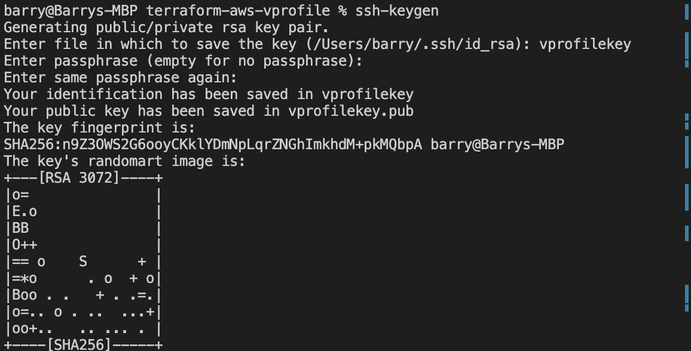
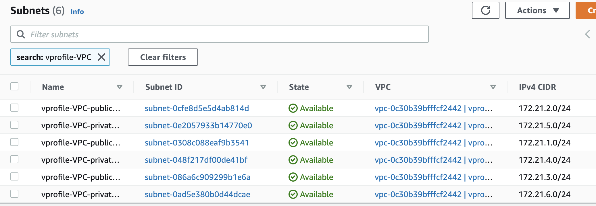
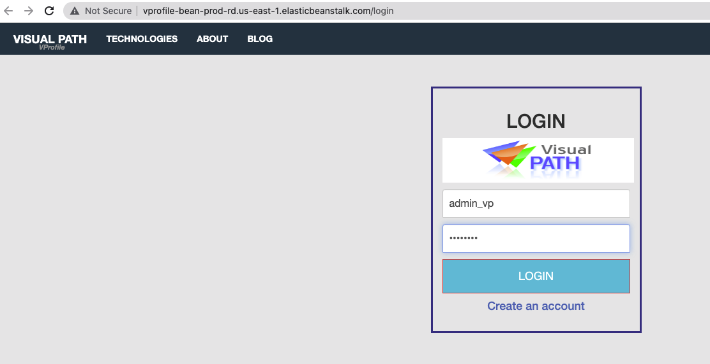

# TERRAFORM FOR CLOUD STATE MANAGEMENT
##  SYSTEM DESIGN

##  Pre-requisites
+ AWS Account
+ GitHub account
+ Terraform, Maven, JDK installed locally
+ IDE (VS Code, IntelliJ, etc)

##  Step 1: Create a Github repository
+ Create a repo in GitHub and name it as `terraform-aws-vprofile`. Keeping the repository public since we will not be storing our credential in the repository, but if we are to store our credentials, then we go for the private repository.

##  Step 2: Clone the source code to local
+ We will clone the repository to the IDE that we will be using. I will be using VsCode for this project.

##  Step 3: Terraform Setup
+ We need to install [Terraform](https://developer.hashicorp.com/terraform/downloads) and [awscli](https://docs.aws.amazon.com/cli/latest/userguide/getting-started-install.html) locally for this project. You can follow documentation to do so.
+ Once both are installed, check their version from terminal/powershell.

+ You need to create an IAM user with Programmatic Access keys. Download credentials. configure aws from cli:

##  Step 4: S3 for Backend
+ Let's create an s3 bucket to store the state in AWS. I will create bucket with awscli command:

      aws s3 mb s3://vprofile-terraform-state-rd --region=us-east-1
      aws s3 ls
+ Create backend-s3.tf file under terraform-aws-vprofile repo with below content:

      terraform {
        backend "s3" {
          bucket = "vprofile-terraform-state-rd"  # replace with your s3 bucketname
          key    = "backend"
          region = "us-east-1"
        }
      }
+ Go to project directory and run terraform init to initialize backend.

##  Step 5: Variables and Providers Files
+ We will create a HA infrastructure for our vprofile project. We will create a VPC with 3 Public subnets and 3 Private subnets. We will create Elasticache, ActiveMQ and RDS-MySQL services for our application. To be able to create a reusable code, we will use variables in our Terraform code.
+ Create `vars.tf` file and `providers.tf` file as in given under terraform-files directory.

##  Step 6: KeyPairs
+ We will create an SSH key with name of `vprofilekey` as we mentioned in `vars.tf` file. Go to `terraform-aws-vprofile` directory, run below command:

+ Now we can create `keypairs.tf` file with below content. We will use file function to get the content from path instead of copy-pasting whole content.

      resource "aws_key_pair" "vprofilekey" {
        key_name   = "vprofilekey"
        public_key = file(var.PUB_KEY_PATH)
      }
+ We can commit/push files to GitHub except private/public key files for safety purpose.
+ Run below commands from working local directory:

      terraform init
      terraform validate
      terraform fmt
      terraform plan
      terraform apply
+ Our first resource keypair is created with terraform.

##  Step 7: VPC Module & Setup
+ One easier way to create resources with terraform is using modules. we can find modules in terraform registry. We will use official VPC [module](https://registry.terraform.io/modules/terraform-aws-modules/vpc/aws/latest) from AWS.
+ Create `vpc.tf` file similar to given file under `terraform-files `directory.
+ We will commit/push this file to remote repo.

+ Since we added a new module, first we need to run:

      terraform init
      terraform validate
      terraform fmt
      terraform plan
      terraform apply

+ Subnet created

##  Step 8: Security Groups Setup
+ We need to create SecGrp for below services:

  + Beanstalk Load Balancer
  + Bastion Host
  + Beanstalk instances
  + Backend services (Active MQ - Elasticache - RDS)
+ Create secgrp.tf file similar to given file under `terraform-files `directory.
+ We will commit/push this file to remote repo and run the ffg command to create resource group

      terraform validate
      terraform fmt
      terraform plan
      terraform apply
##  Step 9: RDS, Elasticache and ActiveMQ Setup
+ Create `backend-services.tf` file similar to given file under terraform-files directory.

+ We will commit/push this file to remote repository.

##  Step 10: Beanstalk ENV Setup
+ Create `bean-app.tf` and `bean-env.tf` files similar to given file under terraform-files directory.

+ We will commit/push this file to remote repo and run the ffg command to create beanstalk group

      terraform validate
      terraform fmt
      terraform plan
      terraform apply

##  Step 11: Bastion Host & DB Initialization
+ We will create a Bastion host then connect to RDS instance through this instance and initialize the Database.
+ We will use templatefile function to initialize RDS. You may checkout more about this function from [documentation](https://developer.hashicorp.com/terraform/language/functions/templatefile)
+ We need to get RDS-endpoint as a environment variable after it is created and replace it in template file to be able to connect to mysql database.
+ Create `templates` directory in project, under the same directory create a file named as `db-deploy.tftplsda` with below content:

      sudo apt update
      sudo apt install git mysql-client -y
      git clone -b vp-rem https://github.com/devopshydclub/vprofile-project.git
      mysql -h ${rds-endpoint} -u ${dbuser} --password=${dbpass} accounts < /home/ubuntu/vprofile-project/src/main/resources/db_backup.sql

+ Create `bastion-host.tf` file similar to given file under `terraform-files` directory.
+ We will commit/push this file to remote repository to create a shell command in the rds instance

      terraform validate
      terraform fmt
      terraform plan
      terraform apply

##  Step 12: Artifact Deployment
+ Clone repository to from bewlo repository, we need to do some updates in application.properties file.

      git clone https://github.com/sadebare/vprofile-project.git
+ 
We will update below parts in that file. Replace db01 -> RDS endpoint Replace mc01 -> elasticache Endpoint Replace rmq01 -> Actice MQ AMQP endpoint(only take url after //) and port rabbitmq.username=rabbit rabbitmq.password=<replace_with_pwd_you_give_in_tf_vars>

      #JDBC Configutation for Database Connection
      jdbc.driverClassName=com.mysql.jdbc.Driver
      jdbc.url=jdbc:mysql://db01:3306/accounts?useUnicode=true&characterEncoding=UTF-8&

      #Memcached Configuration For Active and StandBy Host
      #For Active Host
      memcached.active.host=mc01
      memcached.active.port=11211
      #For StandBy Host
      memcached.standBy.host=127.0.0.2
      memcached.standBy.port=11211

      #RabbitMq Configuration
      rabbitmq.address=rmq01
      rabbitmq.port=5672
      rabbitmq.username=test
      rabbitmq.password=test
+ Save and exit, then go to project directory where pom.xml exists and run mvn install to generate our artifact.
+ Once our artifact is ready, we will upload it to Beanstalk manually.
+ Go to Beanstalk from AWS Console, click on application you created by terraform. Upload and Deploy

##  Step 13: Validate and CleanUp
+ We can validate our application now from browser, click on url given in Benstalk page

+ You can run below command to clean-up your AWS account.

      terraform destroy -auto-approve
