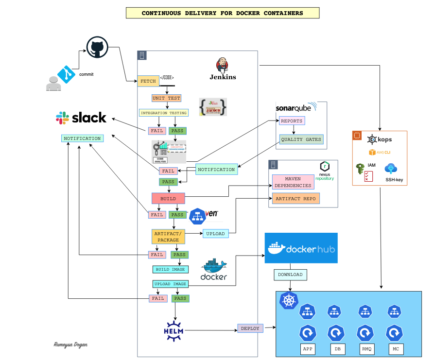
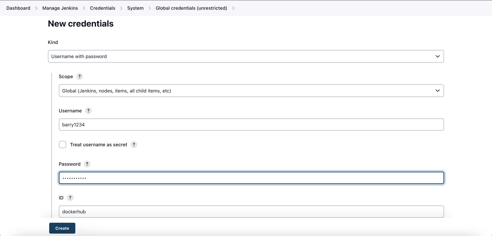
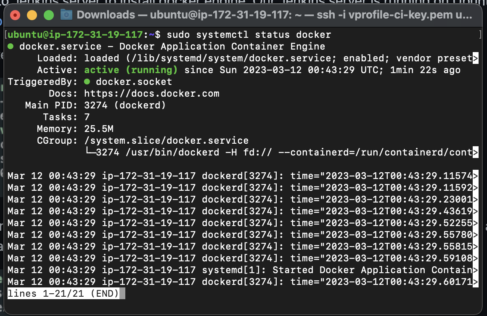
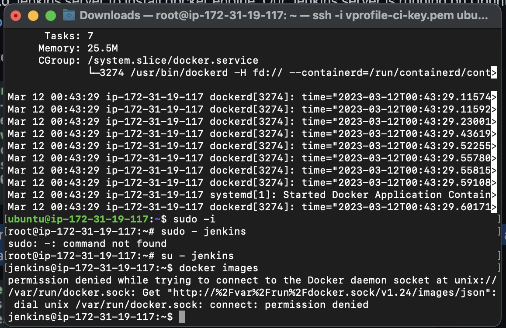
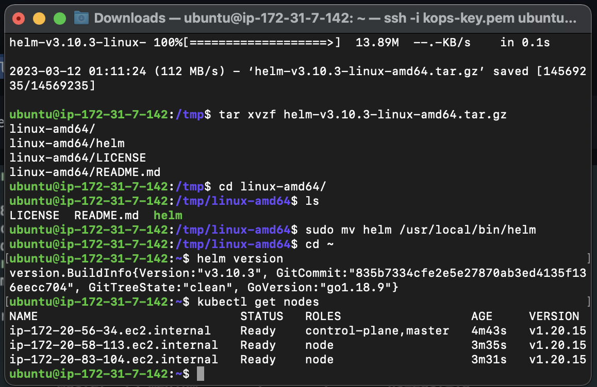
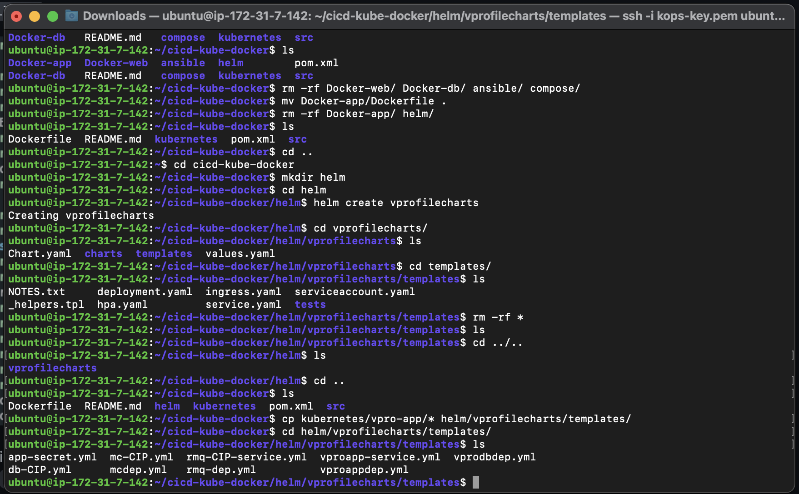
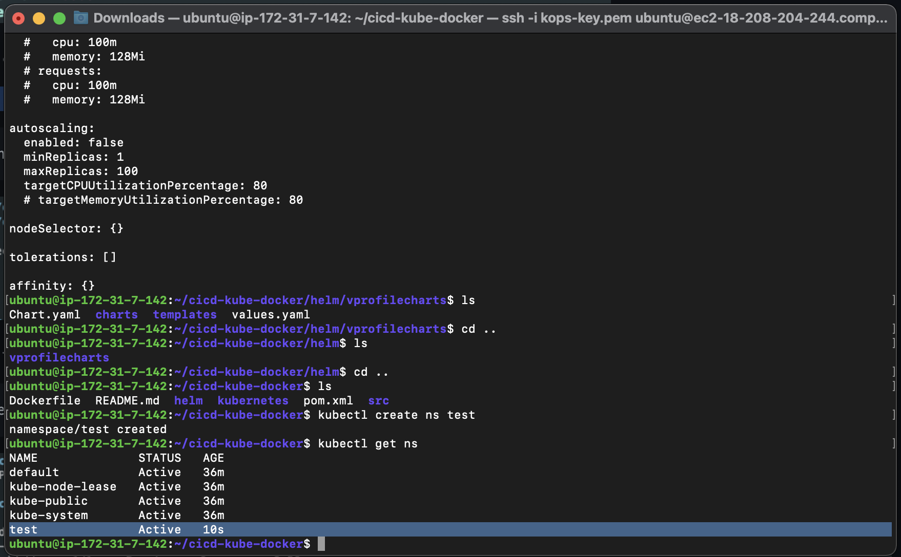
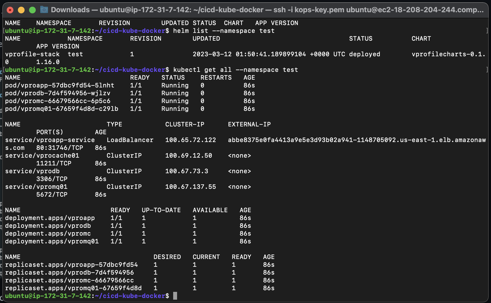
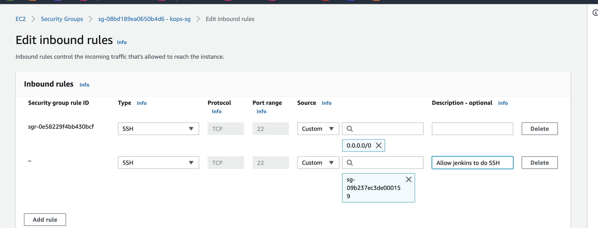
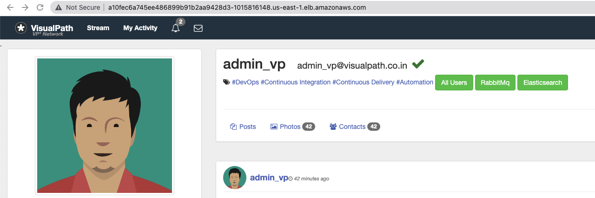

# CONTINUOUS DELIVERY FOR DOCKER CONTAINERS
##  SYSTEM DESIGN

##  Pre-requisite and tools for completing the project
+ **Kubernetes** Setup from Project-13
+ **Docker** engine
+ **Jenkins**, **Nexus** and **Sonar** server setup from Project-5
+ **DockerHub** Account for hosting docker images
+ **Slack** for Notification
+ **Github** account
+ **Helm** for packaging and deploying to k8s cluster
+ **Git** as a version control system
+ **Maven** to build java artifact

### Step-1: Jenkins, Sonar and Docker Integration
+ From Project 5 setup, we are going to spin up our jenkins, SonarServer, while Kops server in k8s to complete this project

+ Go to source code, we will use files under cicd-kube branch from below repository:

      https://github.com/devopshydclub/vprofile-project.git
  - ###  Jenkins-Sonar Integration
    - First we will generate a new token in Sonar server.
    
    - Go to Jenkins server, Manage Jenkins -> Configure System . Find section named as SonarQube Servers.

          Name: sonar-pro  # use the same name, it will be used in our Jenkinsfile
          Server URL: http://<private_ip_of_sonar_server>
          Server Authentication token: Add the new token as secret text
    - Add below security group Inbound rule to Jenkins-SG:

          Allow all traffic from Sonar-SG
    - Add below security group Inbound rule to Jenkins-SG:

          Allow all traffic from Jenkins-SG
+ Jenkins-DockerHub Integration 
We need to add our DockerHub credentials to Jenkins. 
Go to Manage `Jenkins` -> `Manage Credentials` ->` Add credentials.` As ID we will give dockerhub which is used in Jenkinsfile.

+ Install Docker engine in Jenkins server 
Next we will SSH into Jenkins server to install docker engine. Our Jenkins server is running on Ubuntu machine. We will follow official [documentation](https://docs.docker.com/engine/install/ubuntu/) steps to install docker for Ubuntu.<be />
After steps completed, we can check status od docker service.

+ The reason we are installing docker in Jenkins server, we will run docker commands during pipeline as jenkins user. Lets login as jenkins user and try to run any docker command.

      sudo -i
      su - jenkins
      docker images
  
+ The reason for this permission error is, currently only root user is able to run docker commands. Also any user part of docker group can run docker commands. We will add jenkins user to docker group. First run below commands as root user, then switch to jenkins user to test docker commands.

+ To make sure jenkins user is added to docker grp, you can reboot server by simply typing the command on the terminal

      reboot
### Step 2: Jenkins Plugins Installation
+ Go to Jenkins server, Manage Jenkins -> Manage Plugins -> Available. We will install below plugins:

      Docker Pipeline
      Docker
      Pipeline Utility Steps

Click install without Restart.

### Step 3: Kubernetes Cluster Setup
+ Next we will create our kubernetes cluster from kops instance. Lets SSH into kops instance. If you don't have a kops instance, please refer to Project-13 for create one with necessary setup.
+ Now we will run kops command which will create kops cluster.(Note: Don't forget to replace your domain name and s3 bucket name in the command.) Below command won't create cluster, it will create configuration of cluster.

       kops create cluster --name kube.barrydevops.com --state=s3://barry-vprofile-kops-state --zones=us-east-1a,us-east-1b --node-count=2 --node-size=t3.small --master-size=t3.medium --dns-zone=kube.barrydevops.com  --node-volume-size=8 --master-volume-size=8
+ We can create cluster with below command, we need to specify the s3 bucket we use for state config.

      kops update cluster --name kube.barrydevops.com --state=s3://barry-vprofile-kops-state --yes --admin

+ It will take sometime to create cluster. We can install helm as next step.

### Step 4: Helm Installation
+ Helm is a package manager for Kubernetes. We will follow the helm installation steps from official [documentation](https://helm.sh/docs/intro/install/) for Ubuntu. Below steps shows how to download helm from binary. Always use official documentation for installation steps to get latest version.

      cd /tmp
      wget https://get.helm.sh/helm-v3.10.3-linux-amd64.tar.gz
      tar xvzf helm-v3.10.3-linux-amd64.tar.gz
      cd linux-amd64/
      ls
      sudo mv helm /usr/local/bin/helm
      cd ~
      helm version

### Step 5: Cluster state check
+ We can run kubectl command to check if our cluster is ready.

      kubectl get nodes

### Step 6: Git repo setup
+ We will create a GitHub repository with the name of `cicd-kube-docker`. then we will clone it to our kops instance.

      git clone https://github.com/sadebare/cicd-kube-docker.git
+ We will also clone the source code repository that we will be using a lot.

      git clone https://github.com/sadebare/vprofile-project.git
      cd vprofile-project/
      ls
      git checkout vp-docker
      ls
      cp -r * ../cicd-kube-docker/
      cd ..
      cd cicd-kube-docker/
      ls
+ We should see the copied files in our new repository directory. We will remove folders that are not needed.

      rm -rf Docker-web/ Docker-db/ ansible/ compose/
      mv Docker-app/Dockerfile .
      rm -rf Docker-app/ helm/
      ls

### Step 7: Helm charts setup
+ Go to `cicd-kube-docker` directory, we will create a directory called `helm` and run helm command to create our helm charts for vprofile project.

+ We will run the application from latest image as a result of each build. For this reason we need to have a variable for {{.Values.appimage}} instead of hardcoded value in vproappdep.yml file .
+ After making above change now, we are ready to test our helm charts.
+ Go to root directory of your repository and create a new kubernetes namespace.

      kubectl create ns test

+ We can also list our first stack from helm with below command:

      helm list --namespace test

+ Now we can delete our stack with below command:

      helm delete vprofile-stack --namespace test
+ We will create another namesapce which will be used in Jenkins:

      kubectl create namespace prod
+ Now we will add all files we have created under cicd-kube-docker repo to remote repository:

      git add .
      git commit -m "adding helm charts"
      git push

### Step 8: Writing pipeline Code
+ We will create a Jenkinsfile in our source code repository. Open your local cicd-kube-docker repo in one of IDE. I will be using Vscode. Create Jenkinsfile-rd in the root directory.
+ In the deploy stage of Jenkinsfile, we will use helm commands from kops instance. For this, we need to add our Kops instance as Jenkins slave. SSH into kops instance.

      sudo apt update && sudo apt install openjdk-11-jdk -y
      sudo mkdir /opt/jenkins-slave
      sudo chown ubuntu.ubuntu /opt/jenkins-slave -R
      java -version
+ We need to update Kops-SG to allow Jenkins-SG to access this instance on port 22.

+ Then, we need to go to Jenkins server and add Kops instance as jenkins slave. Manage Jenkins --> Manage Nodes and Clouds --> new Node

      Name: kops
      Type: Permanent Agent
      Remote root directory: /opt/jenkins-slave
      Labels: KOPS        # same will be used in Jenkinsfile
      Usage: Only build jobs with label expresiions matching this node
      Launch Method: Launch agents via SSH
      Host: Private IP of KOPS EC2 instance
      Credentials: Add new
          * Type: SSH username with private key
          * Username: ubuntu
          * Private Key: Paste kops-private key you have created before
          * ID: kops-login
          * Description: kops-login
      Host Key Verification Strategy: Non verifying Verification strategy

+ Click Launch Agent to test the connection.

+ Once our Jenkinsfile-rd ready with all its contents, we will commit the changes to GitHub.

+ We have used SonarHome as mysonarscanner4in Jenkinsfile, we will go to Jenkins Manage Jenkins --> Global Tool Configuration. Find sonarQube and change name to mysonarscanner4. Then save it.

### Step 9: Execution
+ Create a new job in Jenkins with name of kube-cicd with type of Pipeline.

      Pipeline Definition: Pipeline script from SCM
      SCM: Git
      Repository URL: https://github.com/rumeysakdogan/cicd-kube-docker.git
      branch: */master
      Script Path: Jenkinsfile-rd
+ We are ready to click Build Now.

+ We can get the LoadBalancer url from k8s cluster and check application from browser.

### Step 10: Clean-Up
+ We can delete our cluster with below command:

      Kops delete cluster --name=kube.barrydevops.com --state=s3://barry-vprofile-kops-state --yes
+ Then stop/terminate instances used during this project.