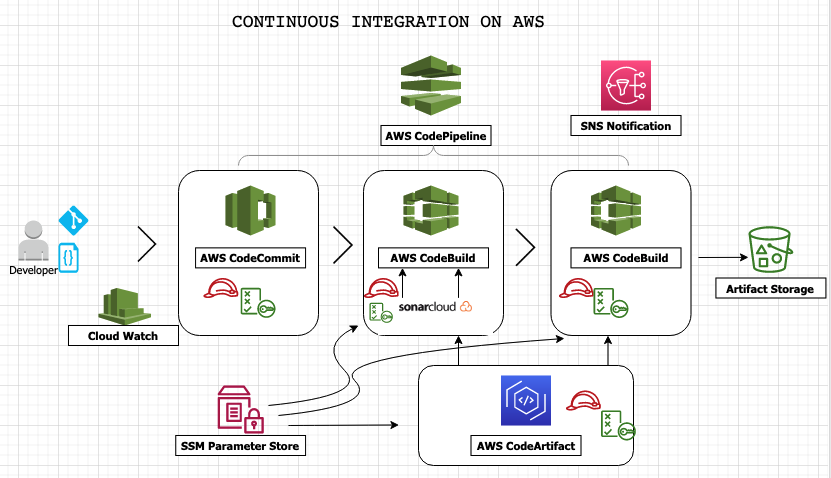
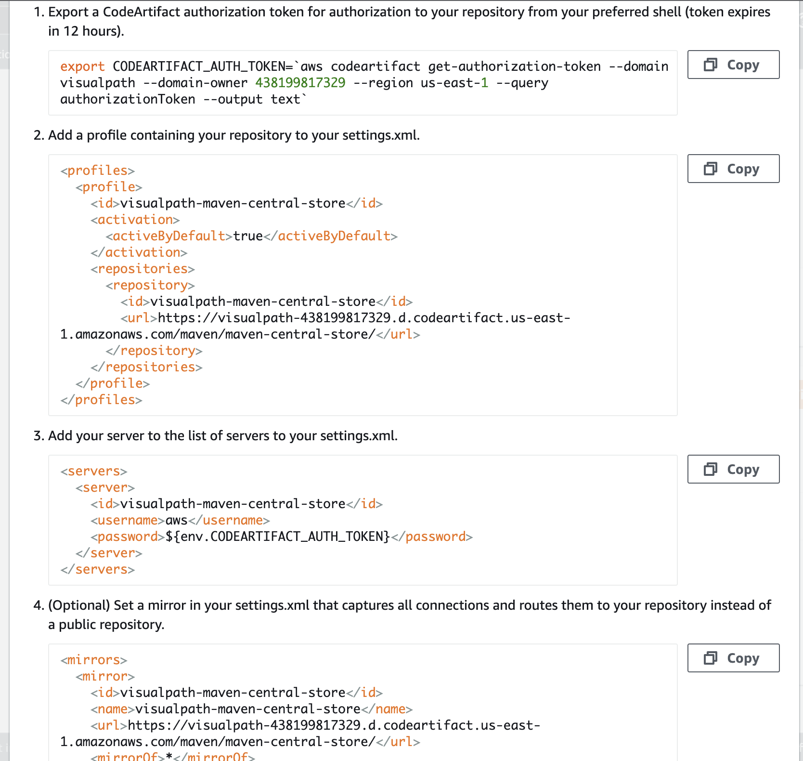
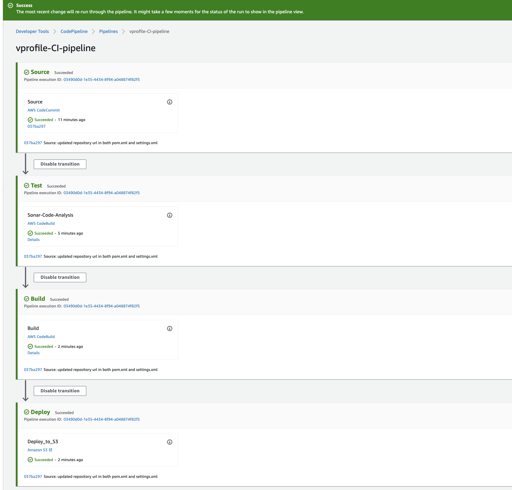

# CONTINUOUS INTEGRATION ON AWS

##  Prerequisite
  + AWS managed service which include: Code commit, Code artifact, Code build and Code deploy, Code pipeline
  + SolarCloud
  + Checkstyle
  + Code editor (e.g sublime, vscode)

## Step 1: AWS CodeCommit Setup 
  + Login to your AWS management console and navigate to CodeCommit section

        CodeCommit > Repository > Create Repository
        Repository details
        name: vprofile-code-repo
  + Create an IAM user for the CodeCommit been created

        IAM > Add user
        --------------
        details of user
        Name: vprofile-code-admin
        Attach policy: Attach the policy created below
        ---------------
        Create a policy to be attached
        service: CodeCommit
        name: vprofile-code-repo
        action: all
        Plicy name: vprofile-code-admin-repo-fullaccess
  + After the creation of the IAM user we can upload SSH public key within the Security credentials section of the newly created user. Generate SSH from our local machine and upload in this section.
  + Create a `config` file at the working directory where we created the ssh key. Working directory:- .ssh/config

        vi .ssh/config
        --------------
        Host git-codecommit.us-east-1.amazonaws.com
        User <SSH_Key_ID_from IAM_user>
        IdentityFile ~/.ssh/vpro-codecommit_rsa
  + Chnage the permission of the config file 

        chmod 600 config
  + We can now test our SSH connection to AWS CodeCommit by running the command

        ssh git-codecommit.us-east-1.amazonaws.com
    
  + Next we clone the repository to a location that we want in our local. I will use the Github repository for vprofile-project in my local, and turn this repository to CodeCommit repository. When I am in Github repo directory, I will run below commands. [source](https://github.com/apotitech/vprofile-project)

        git checkout master
        git branch -a | grep -v HEAD | cut -d'/' -f3 | grep -v master > /tmp/branches
        for i in `cat  /tmp/branches`; do git checkout $i; done
        git fetch --tags
        git remote rm origin
        git remote add origin ssh://git-codecommit.us-east-1.amazonaws.com/v1/repos/vprofile-code-repo
        cat .git/config
        git push origin --all
        git push --tags
    

## Step 2: Code artifact Setup And AWS System Manager Parameter Store
  + Create a Code Artifact for maven 

        Repository name: vprofile-maven-repo
        Public upstream repositories: maven-central-store
        AWS account: current account
        Domain name: visualpath
    
  + Again we will follow connection instructions given in CodeArtifact for maven-central-repo.
    
  + Create an IAM user for CodeArtifact and configure aws cli with its credentials. We will give Programmatic access to this user to be able to use aws cli and download credentials file.

        aws configure # provide iam user credentials

      
  + Run the command below for CodeArtifact authorization token for authorization to your repository 

        export CODEARTIFACT_AUTH_TOKEN=`aws codeartifact get-authorization-token --domain visualpath --domain-owner 438199817329 --region us-east-1 --query authorizationToken --output text`
  + Switch to the working directory that has the repo we are working on and chckout the repo to ci-aws branch

        git checkout ci-aws
  + Update pom.xml and setting.xml file with correct urls as suggested in instruction and push these files to codeCommit.

        git add .
        git commit -m "message"
        git push origin ci-aws
  
##  Step 3: SonarCloud setup For Code Analysis
  + On th brouser paste the url and sign up for sonarcloud account

        https://sonarcloud.io
  + From account avatar -> My Account -> Security. Generate token name as `vprofile-sonar-cloud`. Note the token.
    
  + Next we create a project, `+` -> `Analyze Project` -> `create project manually`. Below details will be used in our Build.

        Organization: apotitech-projectsapotitech-projects
        Name: vprofile-repo
        public
      1[sonar](./images/valid_sonar.png)
##  Step 4: Store Sonar variables in System Manager Parameter Store
  + We will create paramters for below variables.

        Organization: apotitech-projectsapotitech-projects
        CODEARTIFACT_TOKEN	 SecureString	
        HOST      https://sonarcloud.io
        PROJECT                vprofile-repo-rd
        SONARTOKEN             SecureString

##  Step 5: AWS CodeBuild for SonarQube Code Analysis
  + From AWS Console, go to CodeBuild -> Create Build Project. This step is similar to Jenkins Job.
      
        ProjectName: Vprofile-Build
        Source: CodeCommit
        Branch: ci-aws
        Environment: Ubuntu
        runtime: standard:5.0
        New service role
        Insert build commands from foler aws-files/sonar_buildspec.yml
        Logs-> GroupName: vprofile-buildlogs
        StreamName: sonarbuildjob
  + We need to update sonar_buildspec.yml file paramter store sections with the exact names we have given in SSM Parameter store.
  + We need to add a policy to the service role created for this Build project. Find name of role from Environment, go to IAM add policy
  + Now we can build the project
    
  + I can add Quality Gate to this Build Project, we can create a Qulaity gate from SonarCloud and add to our project.

##  Step 6: AWS CodeBuild for Build Artifact
  + From AWS Console, go to CodeBuild -> Create Build Project. This step is similar to Jenkins Job.

        ProjectName: Vprofile-Build-Artifact
        Source: CodeCommit
        Branch: ci-aws
        Environment: Ubuntu
        runtime: standard:5.0
        Use existing role from previous build
        Insert build commands from foler aws-files/build_buildspec.yml
        Logs-> GroupName: vprofile-buildlogs
        StreamName: artifactbuildjob
  + Its time to build project.
  
##  Step 7: AWS CodePipeline and Notification with SNS
  + First we will create an SNS topic from SNS service and subscribe to topic with email.
  + We need confirm our subscription from our email.
  + Now we create an S3 bucket to store our deployed artifacts.
  + Create CodePipeline with the information

        Name: vprofile-CI-Pipeline
        SourceProvider: Codecommit
        branch: ci-aws
        Change detection options: CloudWatch events
        Build Provider: CodeBuild
        ProjectName: vprofile-Build-Aetifact
        BuildType: single build
        Deploy provider: Amazon S3
        Bucket name: vprofile98-build-artifact
        object name: pipeline-artifact
  + Last step before running our pipeline is we need to setup Notifications, go to Settings in CodePipeline -> Notifications.
  + Let's run our CodePipeline.
  
##  Step 8: Validate CodePipeline
  + We can make some changes in README file of source code, once we push the changes CloudWatch will detect the changes and Notification event will trigger Pipeline.
